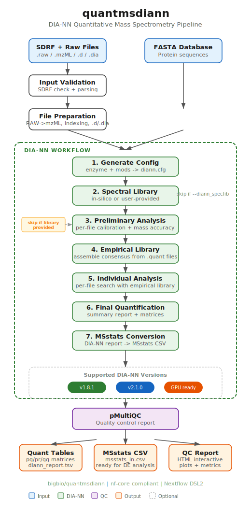

# quantmsdiann

[](https://github.com/bigbio/quantmsdiann/actions/workflows/ci.yml)
[](https://github.com/bigbio/quantmsdiann/actions/workflows/linting.yml)
[](https://doi.org/10.5281/zenodo.15573386)
[](https://www.nf-test.com)

[](https://www.nextflow.io/)
[](https://github.com/nf-core/tools/releases/tag/3.5.2)
[](https://www.docker.com/)
[](https://sylabs.io/docs/)

## Introduction

**quantmsdiann** is a [bigbio](https://github.com/bigbio) bioinformatics pipeline, built following [nf-core](https://nf-co.re/) guidelines, for **Data-Independent Acquisition (DIA)** quantitative mass spectrometry analysis using [DIA-NN](https://github.com/vdemichev/DiaNN).

The pipeline is built using [Nextflow](https://www.nextflow.io), a workflow tool to run tasks across multiple compute infrastructures in a portable manner. It uses Docker/Singularity containers making results highly reproducible. The [Nextflow DSL2](https://www.nextflow.io/docs/latest/dsl2.html) implementation of this pipeline uses one container per process, making it easy to maintain and update software dependencies.

## Pipeline summary

<p align="center">
  
</p>

The pipeline takes [SDRF](https://github.com/bigbio/proteomics-metadata-standard) metadata and mass spectrometry data files (`.raw`, `.mzML`, `.d`, `.dia`) as input and performs:

1. **Input validation** — SDRF parsing and validation
2. **File preparation** — RAW to mzML conversion (ThermoRawFileParser), indexing, Bruker `.d` handling
3. **In-silico spectral library generation** — or use a user-provided library (`--diann_speclib`)
4. **Preliminary analysis** — per-file calibration and mass accuracy estimation
5. **Empirical library assembly** — consensus library from preliminary results
6. **Individual analysis** — per-file search with the empirical library
7. **Final quantification** — protein/peptide/gene group matrices
8. **MSstats conversion** — DIA-NN report to MSstats-compatible format
9. **Quality control** — interactive QC report via [pmultiqc](https://github.com/bigbio/pmultiqc)

## Supported DIA-NN Versions

| Version         | Profile        | Container                                  | Output format |
| --------------- | -------------- | ------------------------------------------ | ------------- |
| 1.8.1 (default) | `diann_v1_8_1` | `docker.io/biocontainers/diann:v1.8.1_cv1` | TSV           |
| 2.1.0           | `diann_v2_1_0` | `ghcr.io/bigbio/diann:2.1.0`               | Parquet       |
| 2.2.0           | `diann_v2_2_0` | `ghcr.io/bigbio/diann:2.2.0`               | Parquet       |

Switch versions with `-profile diann_v2_1_0,docker`. See the [DIA-NN Version Selection](docs/usage.md#dia-nn-version-selection) section for details.

## Quick start

> [!NOTE]
> If you are new to Nextflow and nf-core, please refer to [this page](https://nf-co.re/docs/usage/installation) on how to set up Nextflow.

```bash
nextflow run bigbio/quantmsdiann \
    --input 'experiment.sdrf.tsv' \
    --database 'proteins.fasta' \
    --outdir './results' \
    -profile docker
```

> [!WARNING]
> Please provide pipeline parameters via the CLI or Nextflow `-params-file` option. Custom config files specified with `-c` must only be used for [tuning process resource specifications](https://nf-co.re/docs/usage/configuration#tuning-workflow-resources), not for defining parameters.

## Documentation

- [Usage](docs/usage.md) — How to run the pipeline, input formats, optional outputs, and custom configuration
- [Parameters](docs/parameters.md) — Complete reference of all pipeline parameters organised by category
- [Output](docs/output.md) — Description of all output files produced by the pipeline

## Credits

quantmsdiann is developed and maintained by:

- [Yasset Perez-Riverol](https://github.com/ypriverol) (EMBL-EBI)
- [Dai Chengxin](https://github.com/daichengxin) (Beijing Proteome Research Center)
- [Julianus Pfeuffer](https://github.com/jpfeuffer) (Freie Universitat Berlin)
- [Vadim Demichev](https://github.com/vdemichev) (Charite Universitaetsmedizin Berlin)
- [Qi-Xuan Yue](https://github.com/yueqixuan) (Chongqing University of Posts and Telecommunications)

## Contributions and Support

If you would like to contribute to this pipeline, please see the [contributing guidelines](.github/CONTRIBUTING.md).

## Citation

If you use quantmsdiann in your research, please cite:

> Dai et al. "quantms: a cloud-based pipeline for quantitative proteomics" (2024). DOI: [10.5281/zenodo.15573386](https://doi.org/10.5281/zenodo.15573386)

An extensive list of references for the tools used by the pipeline can be found in the [CITATIONS.md](CITATIONS.md) file.

## License

[MIT](LICENSE)
